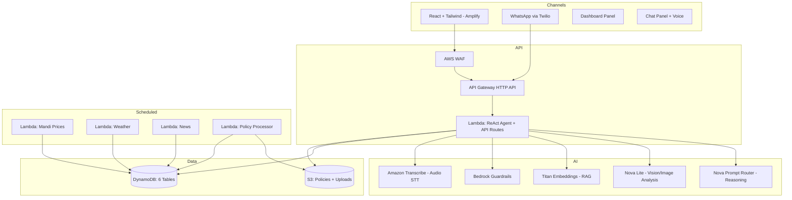

# Design Document: Agri-Mitra

## Overview

Agri-Mitra is a GenAI-powered agricultural assistant for Indian farmers, built entirely on AWS. It uses a **ReAct (Reason-Act-Observe) agent** powered by Amazon Bedrock, served via a Lambda function behind API Gateway, with a React frontend on AWS Amplify and a **WhatsApp channel** via Twilio.

**Core principle: "LLMs reason; AWS services execute."** The LLM handles reasoning and tool selection; DynamoDB, S3, and Lambda handle data.

## Architecture

```
React (Amplify)  ─┐
                   ├→ API Gateway (HTTP) → Lambda (ReAct Agent) → Bedrock / DynamoDB / S3
WhatsApp (Twilio) ─┘
```



## Backend: Single Lambda Handler

The entire backend runs as a **single Lambda function** (`simple_lambda_handler.py`) that handles all API routes, the ReAct agent, and the WhatsApp webhook. This was chosen over ECS Fargate for cost and simplicity — no Docker, no VPC, no long-running containers.

**Routes:**
- `POST /api/chat` — ReAct agent loop (up to 5 iterations)
- `POST /api/upload` — Multipart image upload to S3
- `GET /api/dashboard/prices` — Cached mandi prices from DynamoDB
- `GET /api/dashboard/weather` — Cached weather data
- `GET /api/dashboard/news` — Cached agricultural news
- `POST /sms` — Twilio WhatsApp/SMS webhook
- `GET /health` — Health check

**Lambda config:** Python 3.12, 1536 MB memory, 60s timeout, X-Ray tracing enabled.

## ReAct Agent

The agent implements a Reason-Act-Observe loop using Bedrock's Converse API with tool use:

```
User Message → Model (with tools) → Tool Call? → Execute Tool → Feed Result Back → Loop or Final Answer
```

**Model:** Amazon Nova Intelligent Prompt Router (`default-prompt-router/amazon.nova:1`) — automatically routes to the optimal Nova model per request for cost efficiency.

**Vision Model:** Amazon Nova Lite (`apac.amazon.nova-lite-v1:0`) — used directly for image analysis (prompt router doesn't support multimodal inputs).

**Bedrock Guardrails:** All chat responses pass through a content safety guardrail (`3mfg8d8vj4ee`) with trace logging. Image analysis calls bypass the guardrail to avoid false positives on agricultural imagery.

**Tools (6):**
| Tool | Purpose |
|---|---|
| `get_mandi_prices` | Query DynamoDB for crop prices by name, state, or market |
| `get_weather` | Query DynamoDB for weather by district |
| `get_news` | Query DynamoDB for agricultural news by category |
| `search_policies` | RAG: embed query → cosine similarity → fetch S3 documents |
| `analyze_crop_image` | Fetch image from S3, analyze via Nova Lite Vision |
| `calculate` | Deterministic agricultural calculations (yield, cost, profit) |

**Conversation memory:** Client-side — the frontend sends the last 10 messages as `history[]` with each request. The Lambda is stateless.

**Language matching:** The system prompt instructs the model to respond in the same language as the user's question. Supports Hindi, English, and other Indian languages.

## WhatsApp Channel (Twilio)

Farmers can interact with Agri-Mitra via WhatsApp — no app download required.

**Flow:**
1. Farmer sends a WhatsApp message (text, image, or voice note) to the Twilio number
2. Twilio forwards the webhook to `POST /sms` on API Gateway
3. Lambda processes the message:
   - **Text:** Passed directly to the ReAct agent
   - **Image:** Downloaded from Twilio (authenticated with Twilio credentials), uploaded to S3, described using Nova Lite Vision, then passed as context to the agent
   - **Voice note:** Audio downloaded from Twilio, transcribed using **Amazon Transcribe** (uploaded to S3 temporarily), transcription text passed to the agent
4. Agent response sent back as TwiML `<Response><Message>` XML

**Conversation history:** For WhatsApp users, the last 10 messages are fetched from the DynamoDB `conversations` table using the sender's phone number as `farmer_id`.

**Async execution:** For complex queries, the Lambda invokes itself asynchronously to avoid Twilio's 15-second webhook timeout.

## Frontend

Single-page React app with a **split layout**:
- **Desktop:** Dashboard (40% left) | Chat (60% right)
- **Mobile:** Bottom tab bar switching between Dashboard and Chat views

**Key features:**
- Voice input via Web Speech API (`SpeechRecognition`) — free, browser-native
- Voice output via Web Speech API (`SpeechSynthesis`) — auto-reads assistant responses
- Image upload with inline preview in chat history
- Markdown rendering for assistant responses (`react-markdown`)
- Loading skeletons, error banners, quick-action buttons
- Auto-detects Hindi (Devanagari) for voice language selection

**Stack:** React 18, TypeScript, Vite, Tailwind CSS.

## Data Layer

### DynamoDB Tables (6)

| Table | PK | SK | Purpose |
|---|---|---|---|
| `agri-mitra-farmers` | `farmer_id` | — | Farmer profiles |
| `agri-mitra-conversations` | `farmer_id` | `timestamp` | Chat history (web + WhatsApp) |
| `agri-mitra-mandi-prices` | `crop_name` | `market_date` | Crop prices |
| `agri-mitra-weather-cache` | `district` | `date` | Weather forecasts |
| `agri-mitra-news` | `category` | `timestamp` | Agricultural news |
| `agri-mitra-policy-documents` | `doc_id` | — | Policy metadata + embeddings |

All tables use PAY_PER_REQUEST billing.

### S3 Buckets (2)

| Bucket | Purpose | Notes |
|---|---|---|
| Policies | Government agricultural documents | Private, read-only by Lambda |
| Uploads | Farmer crop images + temporary audio files | Private, 7-day auto-expiry lifecycle |

## Scheduled Lambda Functions

| Function | Schedule | Source | Target |
|---|---|---|---|
| `fetch_mandi_prices` | Every 6h | data.gov.in API | `mandi-prices` table |
| `fetch_weather` | Every 3h | OpenWeatherMap API | `weather-cache` table |
| `fetch_news` | Every 12h | News APIs | `news` table |
| `process_policy_docs` | S3 trigger | Policies bucket | `policy-documents` table |

API keys stored in AWS Secrets Manager (4 secrets: OpenWeather, News API, data.gov.in, Twilio).

## RAG Pipeline (Policy Search)

1. User asks a policy question
2. Agent calls `search_policies` tool
3. Query text is embedded via Titan Embeddings (`amazon.titan-embed-text-v2:0`)
4. Cosine similarity computed against stored document embeddings in DynamoDB
5. Top-k documents fetched from S3 (truncated to 1000 chars each)
6. Document text returned to agent for synthesis

## Security

- **AWS WAF:** Rate limiting (2000 req/5min per IP), AWS Managed Rules (CommonRuleSet + KnownBadInputsRuleSet), bot detection (blocks missing User-Agent)
- **Bedrock Guardrails:** Content safety filter on all chat responses with trace logging
- **S3:** All buckets block public access; S3-managed encryption at rest
- **IAM:** Least-privilege roles — Lambda scoped to specific tables, buckets, and Bedrock actions
- **Secrets Manager:** 4 secrets for external API keys (OpenWeather, News, data.gov.in, Twilio)
- **CORS:** API Gateway restricts to GET, POST, OPTIONS methods
- **Access Logging:** API Gateway and Lambda logs to CloudWatch (1-week retention)
- **X-Ray:** Distributed tracing on all Lambda invocations

## Error Handling

- **Tool failures:** Agent provides informative fallback responses; individual tool errors don't crash the request
- **Guardrail blocks:** Blocked messages tracked in history to prevent cascading failures
- **Stale data:** Dashboard shows most recent available data with timestamps
- **External API failures:** Scheduled Lambdas use cached data; agent informs user
- **Upload failures:** Frontend shows error message; user can retry
- **WhatsApp timeout:** Long-running queries handled via async Lambda self-invocation
- **Audio transcription failure:** User receives error message suggesting text input instead
