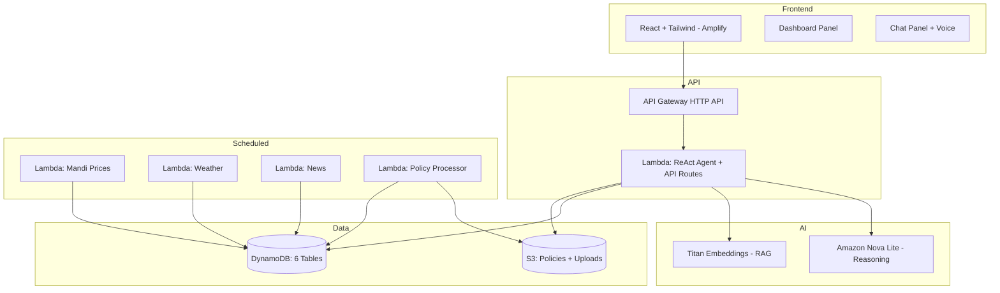

# Design Document: Agri-Mitra

## Overview

Agri-Mitra is a GenAI-powered agricultural assistant for Indian farmers, built entirely on AWS. It uses a **ReAct (Reason-Act-Observe) agent** powered by Amazon Bedrock, served via a Lambda function behind API Gateway, with a React frontend hosted on AWS Amplify.

**Core principle: "LLMs reason; AWS services execute."** The LLM handles reasoning and tool selection; DynamoDB, S3, and Lambda handle data.

## Architecture

```
React (Amplify) → API Gateway (HTTP) → Lambda (ReAct Agent) → Bedrock / DynamoDB / S3
```



## Backend: Single Lambda Handler

The entire backend runs as a **single Lambda function** (`simple_lambda_handler.py`) that handles all API routes and contains the ReAct agent. This was chosen over ECS Fargate for cost and simplicity — no Docker, no VPC, no long-running containers.

**Routes:**
- `POST /api/chat` — ReAct agent loop (up to 5 iterations)
- `POST /api/upload` — Multipart image upload to S3
- `GET /api/dashboard/prices` — Cached mandi prices from DynamoDB
- `GET /api/dashboard/weather` — Cached weather data
- `GET /api/dashboard/news` — Cached agricultural news
- `GET /health` — Health check

**Lambda config:** Python 3.12, 1536 MB memory, 60s timeout, X-Ray tracing enabled.

## ReAct Agent

The agent implements a Reason-Act-Observe loop using Bedrock's Converse API with tool use:

```
User Message → Model (with tools) → Tool Call? → Execute Tool → Feed Result Back → Loop or Final Answer
```

**Model:** Amazon Nova Lite (`apac.amazon.nova-lite-v1:0`) via APAC inference profile.

**Tools (6):**
| Tool | Purpose |
|---|---|
| `get_mandi_prices` | Query DynamoDB for crop prices by name, state, or market |
| `get_weather` | Query DynamoDB for weather by district |
| `get_news` | Query DynamoDB for agricultural news by category |
| `search_policies` | RAG: embed query → cosine similarity → fetch S3 documents |
| `analyze_crop_image` | Fetch image from S3 and analyze via Bedrock Vision |
| `calculate` | Deterministic agricultural calculations (yield, cost, profit) |

**Conversation memory:** Client-side — the frontend sends the last 10 messages as `history[]` with each request. The Lambda is stateless.

**Language matching:** The system prompt instructs the model to respond in the same language as the user's question. Supports Hindi, English, and other Indian languages.

## Frontend

Single-page React app with a **split layout**:
- **Desktop:** Dashboard (40% left) | Chat (60% right)
- **Mobile:** Bottom tab bar switching between Dashboard and Chat views

**Key features:**
- Voice input via Web Speech API (`SpeechRecognition`) — free, browser-native
- Voice output via Web Speech API (`SpeechSynthesis`) — auto-reads assistant responses
- Image upload for crop disease diagnosis
- Loading skeletons, error banners, quick-action buttons
- Auto-detects Hindi (Devanagari) for voice language selection

**Stack:** React 18, TypeScript, Vite, Tailwind CSS.

## Data Layer

### DynamoDB Tables (6)

| Table | PK | SK | Purpose |
|---|---|---|---|
| `agri-mitra-farmers` | `farmer_id` | — | Farmer profiles |
| `agri-mitra-conversations` | `farmer_id` | `timestamp` | Chat history |
| `agri-mitra-mandi-prices` | `crop_name` | `market_date` | Crop prices |
| `agri-mitra-weather-cache` | `district` | `date` | Weather forecasts |
| `agri-mitra-news` | `category` | `timestamp` | Agricultural news |
| `agri-mitra-policy-documents` | `doc_id` | — | Policy metadata + embeddings |

All tables use PAY_PER_REQUEST billing.

### S3 Buckets (2)

| Bucket | Purpose | Notes |
|---|---|---|
| Policies | Government agricultural documents | Private, read-only by Lambda |
| Uploads | Farmer crop images | Private, 7-day auto-expiry lifecycle |

## Scheduled Lambda Functions

| Function | Schedule | Source | Target |
|---|---|---|---|
| `fetch_mandi_prices` | Every 6h | data.gov.in API | `mandi-prices` table |
| `fetch_weather` | Every 3h | OpenWeatherMap API | `weather-cache` table |
| `fetch_news` | Every 12h | News APIs | `news` table |
| `process_policy_docs` | S3 trigger | Policies bucket | `policy-documents` table |

API keys stored in AWS Secrets Manager.

## RAG Pipeline (Policy Search)

1. User asks a policy question
2. Agent calls `search_policies` tool
3. Query text is embedded via Titan Embeddings (`amazon.titan-embed-text-v2:0`)
4. Cosine similarity computed against stored document embeddings in DynamoDB
5. Top-k documents fetched from S3
6. Document text returned to agent for synthesis

## Error Handling

- **Tool failures:** Agent provides informative fallback responses
- **Stale data:** Dashboard shows most recent available data with timestamps
- **External API failures:** Scheduled Lambdas use cached data; agent informs user
- **Upload failures:** Frontend shows error toast; user can retry

## Security

- All S3 buckets block public access
- Lambda uses least-privilege IAM (scoped to specific tables/buckets)
- API Gateway handles CORS
- Data encrypted at rest (S3 managed encryption) and in transit (TLS)
- Secrets Manager for external API keys
