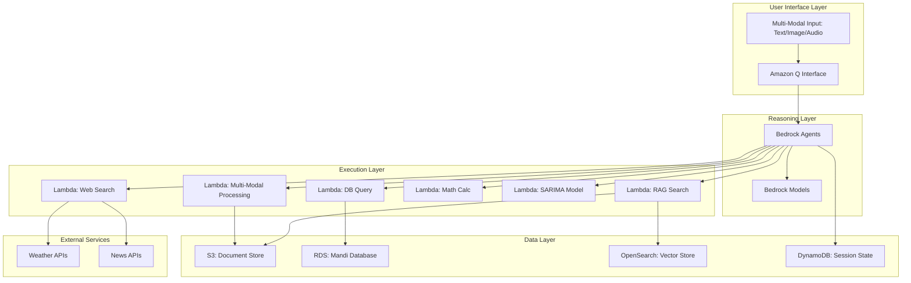

# Design Document: Agri-Mitra Support Agent

## Overview

Agri-Mitra is a production-grade autonomous support agent built entirely on AWS infrastructure, designed to provide comprehensive agricultural assistance to farmers in India. The system follows AWS Well-Architected Framework principles and implements a serverless, event-driven architecture that scales automatically based on demand.

The core design principle is **"LLMs reason; AWS services execute"** - Amazon Bedrock Agents handle reasoning and orchestration while AWS Lambda functions execute all computational tasks. Amazon Q provides the conversational interface, ensuring enterprise-grade security and compliance.

## Architecture

### High-Level Architecture



### Component Architecture

The system implements a microservices architecture using AWS serverless components:

1. **Interface Layer**: Amazon Q handles all user interactions with built-in multi-modal support
2. **Orchestration Layer**: Bedrock Agents coordinate tool selection and execution
3. **Execution Layer**: Specialized Lambda functions for each capability
4. **Data Layer**: Multiple AWS data services optimized for specific use cases
5. **Security Layer**: IAM roles and policies enforcing least-privilege access

## Components and Interfaces

### Amazon Q Interface Component

**Purpose**: Provides the primary conversational interface with enterprise security and multi-modal support.

**Interfaces**:
- **Input Interface**: Accepts text, image, and audio inputs in multiple Indian languages
- **Output Interface**: Returns formatted responses with rich media support
- **Session Management**: Maintains conversation context and user preferences
- **Authentication**: Integrates with AWS IAM for user authentication and authorization

**Key Features**:
- Built-in language detection and translation capabilities
- Enterprise-grade security and compliance features
- Automatic conversation logging and audit trails
- Integration with AWS services through native connectors

### Bedrock Agents Orchestration Component

**Purpose**: Provides intelligent reasoning, tool selection, and workflow orchestration.

**Interfaces**:
- **Agent Interface**: Receives queries from Amazon Q and returns structured responses
- **Tool Registry**: Maintains registry of available Lambda functions and their capabilities
- **Context Management**: Manages conversation state and multi-turn interactions
- **Model Interface**: Interfaces with Bedrock foundation models for reasoning

**Key Features**:
- Automatic tool selection based on query analysis
- Multi-step workflow orchestration
- Error handling and fallback strategies
- Performance optimization through caching and parallel execution

### Lambda Function Components

#### RAG Search Function
**Purpose**: Executes document retrieval and knowledge base searches.

**Interfaces**:
- **Search Interface**: Accepts search queries and returns ranked results
- **Vector Store Interface**: Queries OpenSearch for semantic similarity
- **Document Store Interface**: Retrieves full documents from S3
- **Embedding Interface**: Generates embeddings using Bedrock models

#### Web Search Function
**Purpose**: Performs real-time web searches for weather and news information.

**Interfaces**:
- **Weather API Interface**: Integrates with weather service providers
- **News API Interface**: Searches agricultural news sources
- **Content Filter Interface**: Validates and filters search results
- **Cache Interface**: Implements caching for frequently requested information

#### Database Query Function
**Purpose**: Executes read-only queries against mandi price databases.

**Interfaces**:
- **SQL Interface**: Executes parameterized queries against RDS instances
- **Connection Pool Interface**: Manages database connections efficiently
- **Data Validation Interface**: Validates query parameters and results
- **Audit Interface**: Logs all database access for compliance

#### Mathematical Calculation Function
**Purpose**: Performs deterministic agricultural calculations.

**Interfaces**:
- **Calculation Interface**: Accepts calculation requests with parameters
- **Validation Interface**: Validates input parameters and constraints
- **Formula Library Interface**: Accesses pre-defined agricultural formulas
- **Result Formatting Interface**: Formats results with explanations

#### SARIMA Modeling Function
**Purpose**: Executes time-series analysis and price predictions.

**Interfaces**:
- **Model Interface**: Loads and executes trained SARIMA models
- **Data Preparation Interface**: Prepares historical data for analysis
- **Training Interface**: Retrains models with new data
- **Prediction Interface**: Generates predictions with confidence intervals

#### Multi-Modal Processing Function
**Purpose**: Processes image and audio inputs for agricultural analysis.

**Interfaces**:
- **Image Analysis Interface**: Analyzes crop images using computer vision
- **Audio Processing Interface**: Transcribes and processes audio inputs
- **Content Recognition Interface**: Identifies agricultural objects and conditions
- **Response Generation Interface**: Generates appropriate responses based on analysis

## Data Models

### User Session Model
```
UserSession {
  sessionId: string (UUID)
  userId: string
  language: string (ISO 639-1)
  location: GeoLocation
  conversationHistory: ConversationTurn[]
  preferences: UserPreferences
  createdAt: timestamp
  lastActivity: timestamp
}
```

### Conversation Turn Model
```
ConversationTurn {
  turnId: string (UUID)
  userInput: MultiModalInput
  systemResponse: SystemResponse
  toolsUsed: ToolExecution[]
  timestamp: timestamp
  processingTime: number
}
```

### Multi-Modal Input Model
```
MultiModalInput {
  type: enum [TEXT, IMAGE, AUDIO]
  content: string | binary
  language: string
  metadata: InputMetadata
}
```

### Tool Execution Model
```
ToolExecution {
  toolName: string
  parameters: object
  result: object
  executionTime: number
  status: enum [SUCCESS, ERROR, TIMEOUT]
  errorMessage: string?
}
```

### Agricultural Query Model
```
AgriculturalQuery {
  queryType: enum [CROP_DISEASE, WEATHER, PRICING, CALCULATION, PREDICTION]
  cropType: string?
  location: GeoLocation?
  timeframe: DateRange?
  parameters: object
}
```

### Mandi Price Model
```
MandiPrice {
  marketId: string
  cropName: string
  variety: string
  pricePerQuintal: decimal
  date: date
  quality: string
  arrivals: number
  source: string
}
```

### Weather Data Model
```
WeatherData {
  location: GeoLocation
  date: date
  temperature: TemperatureRange
  humidity: number
  rainfall: number
  windSpeed: number
  forecast: WeatherForecast[]
  agriculturalAdvisory: string
}
```

### Document Model
```
Document {
  documentId: string (UUID)
  title: string
  content: string
  documentType: enum [POLICY, BULLETIN, ADVISORY]
  language: string
  publishedDate: date
  source: string
  tags: string[]
  embedding: vector
}
```

## Correctness Properties

*A property is a characteristic or behavior that should hold true across all valid executions of a system—essentially, a formal statement about what the system should do. Properties serve as the bridge between human-readable specifications and machine-verifiable correctness guarantees.*

### Property Reflection

After analyzing all acceptance criteria, several properties can be consolidated to eliminate redundancy:

- Language consistency properties (1.1, 1.3) can be combined into a single multi-modal language consistency property
- Context preservation properties (1.5, 2.4) can be combined into a comprehensive context management property  
- Tool selection and orchestration properties (2.1, 2.2) can be combined into a single orchestration property
- Data retrieval properties (3.1, 3.2, 5.1, 5.2) can be consolidated into location-aware data retrieval properties
- Error handling and fallback properties (2.3, 4.5, 5.5, 7.5) can be combined into comprehensive fallback behavior properties

### Core Functional Properties

**Property 1: Multi-Modal Language Consistency**
*For any* user input in a supported Indian language (text, audio, or image with text), the system response should be in the same language as the input, maintaining linguistic consistency across all interaction modalities.
**Validates: Requirements 1.1, 1.3**

**Property 2: Image Analysis Relevance**
*For any* uploaded crop or agricultural condition image, the system should provide agricultural advice that is contextually relevant to the visual content identified in the image.
**Validates: Requirements 1.2**

**Property 3: Context Preservation Across Modalities**
*For any* conversation involving multiple input modalities (text, image, audio), the system should maintain conversation context and reference previous interactions regardless of the input modality used.
**Validates: Requirements 1.5, 2.4**

**Property 4: Intelligent Tool Orchestration**
*For any* user query requiring multiple tools, the system should select appropriate tools and execute them in a logical sequence that produces coherent and complete responses.
**Validates: Requirements 2.1, 2.2**

**Property 5: Graceful Error Handling**
*For any* tool execution failure or data unavailability scenario, the system should provide alternative approaches or informative error responses without system failure.
**Validates: Requirements 2.3, 4.5, 5.5, 7.5**

**Property 6: Location-Aware Information Prioritization**
*For any* agricultural query with location context, the system should prioritize local and contextually relevant information over generic advice in its responses.
**Validates: Requirements 2.5, 3.2**

**Property 7: Document Retrieval Accuracy**
*For any* policy or procedure query, the system should retrieve documents that are semantically relevant to the query and synthesize information coherently when multiple sources exist.
**Validates: Requirements 3.1, 3.5**

**Property 8: Weather Data Contextual Formatting**
*For any* weather information request, the system should provide location-specific forecasts that include agricultural relevance indicators and actionable farming advice.
**Validates: Requirements 4.1, 4.2**

**Property 9: News Search Relevance and Recency**
*For any* agricultural news request, the system should return results that are both recent and relevant to the agricultural context, with appropriate validation and filtering applied.
**Validates: Requirements 4.3, 4.4**

**Property 10: Price Data Accuracy and Completeness**
*For any* crop price query, the system should return accurate current or historical price data for the specified crops and markets, with appropriate formatting and context.
**Validates: Requirements 5.1, 5.2, 5.3**

**Property 11: Mathematical Calculation Determinism**
*For any* agricultural calculation request with valid parameters, the system should produce deterministic results using location and crop-specific parameters when available, with clear methodology explanations.
**Validates: Requirements 6.1, 6.2, 6.4**

**Property 12: Input Validation for Calculations**
*For any* calculation request with invalid or insufficient parameters, the system should validate inputs and either reject invalid inputs or request additional information with confidence intervals.
**Validates: Requirements 6.3, 6.5**

**Property 13: SARIMA Prediction Completeness**
*For any* price prediction request, the system should execute SARIMA analysis incorporating seasonal patterns and provide predictions with confidence intervals and uncertainty measures.
**Validates: Requirements 7.1, 7.2, 7.3**

**Property 14: Audit Trail Completeness**
*For any* system interaction or external data access, the system should generate complete audit logs that capture all requests, responses, and access attempts.
**Validates: Requirements 8.2, 8.4**

**Property 15: Error Monitoring and Alerting**
*For any* system error or performance threshold breach, the system should generate appropriate alerts, detailed error logs, and trigger automated responses.
**Validates: Requirements 9.2, 9.4**

**Property 16: Performance Metrics Tracking**
*For any* system operation, the system should track and record performance metrics including response times, success rates, and resource utilization.
**Validates: Requirements 9.3**

**Property 17: Response Time Consistency**
*For any* user query under normal load conditions, the system should respond within 5 seconds while maintaining response quality and accuracy.
**Validates: Requirements 10.1, 10.3**

**Property 18: Auto-Scaling Effectiveness**
*For any* increase in system load, the Lambda functions should automatically scale to maintain response time requirements without degrading service quality.
**Validates: Requirements 10.2**

**Property 19: Fallback Mechanism Reliability**
*For any* external service unavailability, the system should provide cached responses or alternative information sources to maintain service continuity.
**Validates: Requirements 10.4**

**Property 20: Data Minimization and Lifecycle Management**
*For any* farmer data processing, the system should collect only necessary data for stated purposes and manage data lifecycle according to retention policies.
**Validates: Requirements 11.2, 11.3**

**Property 21: Data Access Control**
*For any* farmer request to access, modify, or delete personal data, the system should provide appropriate mechanisms to fulfill these requests while maintaining data integrity.
**Validates: Requirements 11.5**

## Error Handling

### Error Classification

The system implements a comprehensive error handling strategy with the following error categories:

1. **User Input Errors**: Invalid or malformed user inputs
2. **Service Unavailability Errors**: External service failures or timeouts
3. **Data Access Errors**: Database connection failures or query errors
4. **Processing Errors**: Model execution failures or calculation errors
5. **Authentication/Authorization Errors**: Security-related access failures
6. **Resource Exhaustion Errors**: System capacity or rate limit exceeded

### Error Handling Strategies

**Graceful Degradation**: When primary services fail, the system falls back to cached data or alternative information sources.

**Circuit Breaker Pattern**: Implements circuit breakers for external service calls to prevent cascade failures.

**Retry Logic**: Implements exponential backoff retry logic for transient failures.

**User-Friendly Messages**: Converts technical errors into user-friendly messages in the user's preferred language.

**Fallback Responses**: Provides alternative suggestions when requested information is unavailable.

### Error Recovery Mechanisms

- **Cached Response Fallback**: Uses cached weather, news, or price data when real-time sources are unavailable
- **Alternative Tool Selection**: Selects alternative tools when primary tools fail
- **Partial Response Generation**: Provides partial responses when some tools succeed and others fail
- **Manual Escalation**: Escalates complex errors to human operators when automated recovery fails

## Testing Strategy

### Dual Testing Approach

The system requires both unit testing and property-based testing for comprehensive coverage:

**Unit Tests**: Focus on specific examples, edge cases, and error conditions for individual components. These tests validate concrete scenarios and integration points between AWS services.

**Property Tests**: Verify universal properties across all inputs using randomized test data. These tests ensure the system behaves correctly across the full range of possible inputs and scenarios.

### Property-Based Testing Configuration

- **Testing Framework**: Use Hypothesis (Python) or fast-check (TypeScript) for property-based testing
- **Test Iterations**: Minimum 100 iterations per property test to ensure comprehensive coverage
- **Test Tagging**: Each property test must reference its design document property using the format:
  ```
  # Feature: agri-mitra-support-agent, Property N: [Property Description]
  ```

### Unit Testing Focus Areas

- **AWS Service Integration**: Test Lambda function integrations with Bedrock, OpenSearch, RDS, and S3
- **Multi-Modal Processing**: Test image analysis, audio transcription, and text processing components
- **Data Validation**: Test input validation, parameter checking, and data format validation
- **Error Scenarios**: Test specific error conditions and fallback mechanisms
- **Security Controls**: Test IAM permissions, encryption, and audit logging

### Property Testing Focus Areas

- **Language Consistency**: Test multi-modal language handling across all supported Indian languages
- **Context Preservation**: Test conversation context management across different interaction patterns
- **Tool Orchestration**: Test intelligent tool selection and execution sequencing
- **Data Accuracy**: Test information retrieval, calculation accuracy, and prediction reliability
- **Performance Characteristics**: Test response times, scaling behavior, and resource utilization
- **Error Resilience**: Test system behavior under various failure conditions

### Integration Testing

- **End-to-End Workflows**: Test complete user journeys from input to response
- **AWS Service Dependencies**: Test interactions between Lambda functions and AWS data services
- **External API Integration**: Test weather API, news API, and other external service integrations
- **Multi-Modal Scenarios**: Test complex scenarios involving multiple input modalities
- **Load Testing**: Test system behavior under various load conditions

### Monitoring and Observability Testing

- **Metrics Collection**: Verify that all required metrics are collected and reported correctly
- **Alert Generation**: Test that alerts are generated for appropriate error conditions
- **Audit Trail Validation**: Verify that all interactions are properly logged for compliance
- **Dashboard Functionality**: Test that monitoring dashboards display accurate real-time information

The testing strategy ensures that the Agri-Mitra system meets all functional requirements while maintaining the reliability, security, and performance characteristics required for production deployment.